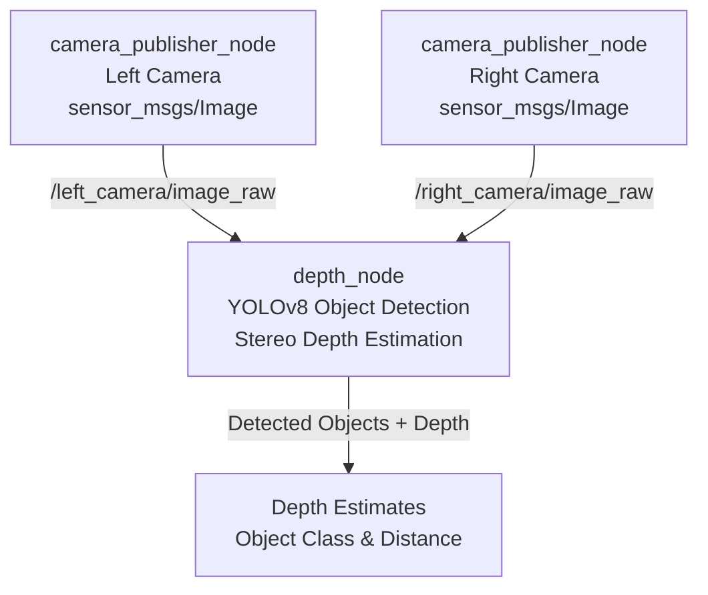

# Excavator object detection and depth estimation pipeline 
This repository contains a ROS2 (Jazzy)-based object detection, classification and depth estimation pipeline developed for an excavator perception system.
This project is part of a bachelor thesis and focuses on detecting objects (in this case traffic signs), classifying them and estimating the distance to them 
using stereo vision and deep-learning object detection models.

This sytem integrates YOLOv8l for object detection and classification, and stereo vision triangulation for depth estimation, both of them running in real time using frames from two synchronized cameras.

# Project overview

The pipeline consists of the following main components:
1) Stereo camera publisher
   - Publishes synchronized frames from the left and right camera
2) Depth estimation node
   - Detects objects in both images using YOLOv8l
   - Rectifies images using stereo calibration parameters
   - Computes depth via triangulation
3) ROS2 debugging and inspection tools
   - Used to monitor topics, nodes and message flow

This system is designed to be modular and extensible for future autonomous machinery applications.


# Technologies used 
- ROS2 Jazzy
- Python
- YOLOv8l (Ultralytics)
- OpenCV
- Stereo vision and triangulation
- nodes,topics, publisher, subscriber, approximate time synchronizer

# Prerequisites

Before executing the pipeline, ensure that :
- ROS2 Jazzy is installed
- The workspace needs to be sourced using setup.bash file
- Camera calibration parameters are available
- Python3 is installed

```
source /opt/ros/jazzy/setup.bash
```

# Workspace setup
```
cd excavator_ws
colcon build
source install/setup.bash
```

# Running the pipeline 
1) Launch the camera publisher
   In the first terminal execute the following commands:
   ```
   cd excavator_ws
   source /opt/ros/jazzy/setup.bash
   colcon build
   source install/setup.bash
   ros2 run camera_publisher camera_publisher
   ```
2) Launch the depth estimation node
   Open a second terminal and run the following commands:
   ```
   cd excavator_ws
   source /opt/ros/jazzy/setup.bash
   colcon build
   source install/setup.bash
   ros2 run depth_node depth_node
 
   ```
   This node performs the following:
   - Subscription to /left_camera/image_raw and /right_camera/image_raw in order to access the stereo image pairs
   - Performs object detection using YOLOv8l
   - Image rectification using calibration parameters
   - Selection of the center points of the detected objects in both frames
   - Depth estimation via stereo triangulation

  # Depth estimation method

  1. Detect objects(traffic signs) in the left and right frames
  2. Rectify the images such that all corresponding points lie on the same epipolar line, achieved with the calibration parameters
  3. Extract the center coordinates of the corresponding detections observed in both frames
  4. Compute disparity between the object centers
  5. Estimate depth using the triangulation geometry (depth = (f * b) / d), where f is the focal distance, b is the baseline and d is the disparity

  This approach enables real-time object detection, classification and depth estimation of the detected traffic signs in front of the excavator.

# Debugging and monitoring
1) List active topics
```
ros2 topic list
```
2) Inspect the published data 
```
ros2 topic echo <topic_name>
```
3) Get topic node information (e.g whether node is subscribed to another node, and on what topic data is published on)
```
ros2 info <topic_name>
``` 
These tools are useful for diagnosing communication issues between nodes.

# Handling Python package conflicts 

If you encounter dependency conflicts(especially with ultralytics or other deep learning libraries), it is recommended to use a dedicated Python virtual environment:
```
python3 -m venv ~/excavator_env
source ~/excavator_env/bin/activate
pip install -r requirements.txt
```
Then rerun the ROS2 nodes from this environment.

# Limitations
- Integration with SLAM or sensor fusion
- Higher resolution cameras to obtain more precise depth estimations

# Author
Ioan-Radu Bocu   
Bachelor thesis project  
Radboud University

# License
This project is intended for academic and research purposes.


